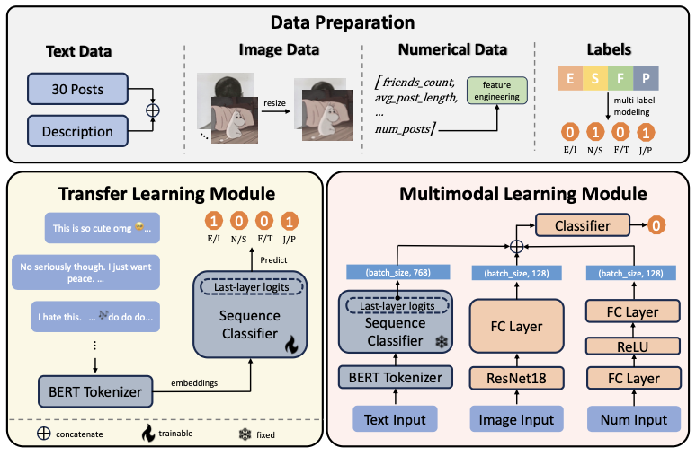

# NLP_CV_project
## MBTI Personality Prediction from Social Media Profiles
<!-- https://youtu.be/XZyjXfCyIaE -->

### Abstract
In this project, we explore the prediction of Myers-Briggs Type Indicator
(MBTI) personality types based on social media profiles. Using a multimodal
approach, we integrate textual, visual, categorical, and numerical data derived
from user posts, profile avatars, and engagement metrics to create a comprehen-
sive predictive model. The framework includes two main components: a Trans-
fer Learning Module, which leverages BERT for textual data, and a Multimodal
Learning Module, which combines all data modalities to capture relationships be-
tween user behaviors and MBTI labels. Experimental results demonstrate high
accuracy in predicting the Feeling/Thinking (F/T), Intuition/Sensing (N/S), and
Judging/Perceiving (J/P) dimensions and relatively lower performance in classi-
fying Extroversion/Introversion (E/I). These results provide insight into the rela-
tionship between personality traits and online behaviors, while presenting avenues
for further exploration to improve predictive accuracy and understand underly-
ing correlates. This study bridges psychology and machine learning, showing the
potential of integrating different types of data for personalized applications in
digital environments.

### Report
Please refer to [the full report here](./report.pdf)

For video presentation: click this [link](https://youtu.be/SLdX1CuNQjQ)

